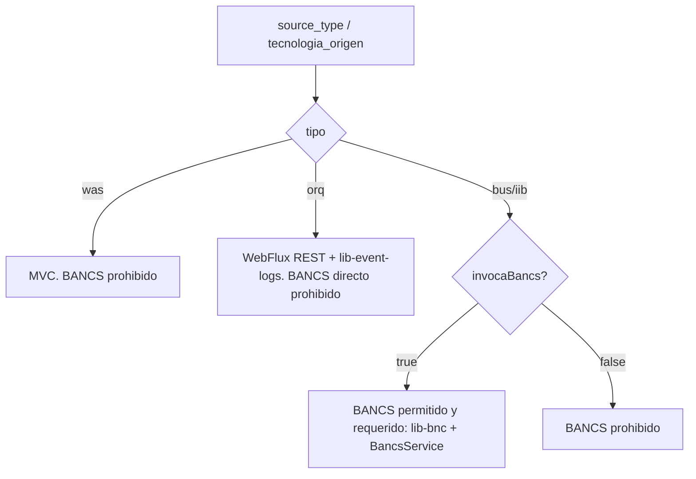

# doublecheck - doble pasada: checklist + autofixes + reporte final

Equivale al comando `capamedia checklist` (v0.23.0) pero ejecutado por el
engine AI elegido desde `capamedia ai doublecheck`. En Claude Code tambien
puede existir como slash command legacy `/doublecheck`.

Se usa **despues de `capamedia ai migrate`** para cerrar todo lo autofixeable
de una sola vez y dejar claro lo que queda como handoff al owner del servicio.

Diferencia con `capamedia check`:
- `capamedia check` - **solo reporta**, no modifica archivos.
- `capamedia ai doublecheck` - reporta + **aplica autofixes** + re-reporta.

## Cuando usarlo

- Despues de que `capamedia ai migrate` termino y el build esta verde.
- Antes de abrir el PR al banco.
- Cuando querés ver **qué queda realmente como trabajo manual** (sin el
  ruido de lo que el CLI puede arreglar solo).

## Input

- Ninguno si estas parado en el workspace root (autodetecta
  `./destino/<svc>` y `./legacy/<svc>`).
- Opcionales: `<project_path>` y `<legacy_path>` explicitos.

## Paso 1 — Pre-flight

Verificar que el workspace este valido:
- Existe `destino/<namespace>-msa-sp-<svc>/` con `build.gradle` + `src/`.
- Existe `legacy/` con el codigo legacy del servicio (opcional pero
  recomendado para cross-checks del Block 0).
- Existe `.capamedia/config.yaml` para leer el service_name.

Si falta `destino/` → abortar con mensaje claro.

## Paso 1.5 - Matriz BANCS obligatoria

Antes de aplicar autofixes, clasificar el proyecto con esta matriz. Esta regla
manda sobre templates, ejemplos previos y sugerencias del modelo:



Si el proyecto es WAS, ORQ o BUS/IIB sin `invocaBancs=true`, el doublecheck
no debe agregar ni mantener `lib-bnc-api-client`, `BancsService`,
`BancsClientHelper`, `bancs.webclients`, `CCC_BANCS_*` ni
`dependsOn: lib-bnc-api-client`. Si aparecen, corregirlos o devolver
`status=blocked`; nunca declararlo PR_READY.

## Paso 2 — Ejecutar `capamedia checklist`

```bash
# Desde el workspace root
capamedia checklist
```

Eso dispara internamente:
1. **Fase A** — correr los 20 bloques de nuestro checklist + autofix loop
   (hasta 3 rondas o convergencia). Los fixes cubren:
   - Regla 4: `@BpLogger` faltante en metodos publicos de `@Service`
   - Regla 6: `StringUtils.*` → Java nativo, extraer records inner del Service
   - Regla 7: `${VAR:default}` → `${VAR}` limpio (preserva `optimus.web.*`)
   - Regla 8: normalizar `lib-bnc-api-client:1.1.0-alpha.*` → `1.1.0` estable
     solo si la matriz permite BANCS (BUS/IIB + invocaBancs=true)
   - Regla 9: esqueleto inicial de `catalog-info.yaml`
   - Block 19: inyectar valores de `.capamedia/inputs/*.properties` a
     `application.yml` (si el owner ya entrego los archivos)

2. **Fase B** — re-correr el checklist para ver el estado final post-fix.

## Paso 2.5 - Peer review del banco

El doublecheck tambien debe revisar el gate del plugin
`frm-plugin-peer-review-gradle`, porque Azure ejecuta `gradle build -x test`
pero el task `architectureReview` sigue corriendo.

```bash
cd destino/<namespace>-msa-sp-<svc>
./gradlew architectureReview
```

Si el comando no existe, leer la salida de `gradle build -x test` o el reporte
en `build/reports`. No declarar OK si aparece cualquiera de estos sintomas:

- score global < 7
- `BLOQUEAR PR: SI`
- `Paquetes: 3 / 4` u observaciones generales por naming/layout
- observaciones de tests: falta `@SpringBootTest`, falta H2,
  falta `application-test.yml`, falta status 200/404/500

Fix esperado:
- mover ports a `application/input/port` y `application/output/port`
- convertir ports a interfaces si queda algun `abstract class`
- agregar integration smoke test con `@SpringBootTest` y la herramienta del
  stack (`MockMvc`, `WebTestClient` o `MockWebServiceClient`)
- mantener unit tests con Mockito para logica de dominio/aplicacion
- asegurar que el `.gitignore` del proyecto migrado ignore artefactos locales
  que no van a Azure DevOps: `.capamedia/`, `.codex/`, `.claude/`,
  `.cursor/`, `.windsurf/`, `.opencode/`, `.github/prompts/`, `.vscode/`,
  `.idea/`, `.mcp.json`, `FABRICS_PROMPT_*.md`, `QA_STATUS.md`, `TRAMAS.txt`.
  No ignorar `.sonarlint/connectedMode.json`.

## Paso 3 — Interpretar el resultado

El reporte final muestra 3 tipos de items:

### ✅ PASS
Reglas que pasaron o se fixearon solas. No hay nada que hacer.

### 🟡 FAIL MEDIUM / LOW residuales
Cosas que NO pudo arreglar el autofix pero que **NO bloquean el PR**.
Ejemplos tipicos:

- `properties-report.yaml` lista archivos PENDING_FROM_BANK (esperar al owner)
- Algunos configurables sin valor real (requieren input de SRE)
- `catalog-info.yaml` tiene owner email placeholder (completar manual)

### 🔴 FAIL HIGH residuales
**Esto sí requiere intervencion manual.** Posibles causas:

- Regla 6: metodos privados en `@Service` que el autofix no supo extraer
  (requiere refactor semantico manual)
- Block 0.2c: framework mal-clasificado (mover el codigo a REST/SOAP segun
  matriz MCP)
- Block 20: ORQ referenciando legacy del target (cambiar URL al servicio
  migrado)
- Block 3: clases con nombres genericos (renombrar con prefijo de dominio)

## Paso 4 — Handoff explicito

Cosas que NO se pueden arreglar automaticamente y deben documentarse como
**handoff** (no como bug):

| Item | Por que no se puede fixear solo | Accion |
|---|---|---|
| `sonarcloud.io/project-key` | SonarCloud genera el UUID al primer analisis | Esperar primer pipeline + copiar el key |
| URL de Confluence | Depende del espacio del equipo | Owner completa manual |
| `.sonarlint/connectedMode.json` con `projectKey` real | SonarCloud genera el UUID al primer analisis | Owner copia el `projectKey`; el archivo no contiene token y debe quedar versionado |
| `<ump>.properties` PENDING | Viene del owner del servicio | Pedirlo + pegar en `.capamedia/inputs/` |
| JNDI desconocido (WAS+BD) | Fuera del catalogo BPTPSRE-Secretos | Consultar con SRE |

Estos quedan marcados como FAIL pero **son esperados** — no cambian al
developer, son handoff a otros roles.

## Paso 5 — Responder conversacionalmente

Al final del doublecheck, responder con un resumen:

```markdown
## Doble check ejecutado: <servicio>

**Pasos corridos:**
- Checklist (20 bloques): <X/Y PASS>
- Autofixes aplicados: <N> (reglas 4, 6, 7, 8, 9 + Block 19 inject)
- Re-check post-fix: <X'/Y PASS>

### Estado final
- PR_READY / READY_WITH_FOLLOW_UP / BLOCKED_BY_HIGH

### Fixes aplicados automaticamente
1. `lib-bnc-api-client` normalizado a 1.1.0 estable
2. `@BpLogger` agregado a 3 metodos de CustomerServiceImpl
3. 4 env vars `${CCC_*}` reemplazados con valores de umpclientes0025.properties
...

### Residuales HIGH (requieren revision manual)
_(si hay)_

### Handoff al owner (NO son bugs)
- `sonarcloud.io/project-key`: completar despues del primer pipeline
- `umpXXXX.properties`: pedir al owner del servicio (keys: ...)

**Proximo paso:** `capamedia review` para correr el validador oficial del banco,
o abrir el PR si no hay residuales HIGH.
```

## Reglas importantes

1. **No saltarse fases.** Checklist → autofix → re-check → reporte. Siempre
   en ese orden.
2. **Severidad conservadora.** Si un fix autofix rompe la compilacion, el
   checklist siguiente lo detecta y marca HIGH.
3. **Nunca inventar secretos ni config keys.** Lo desconocido se marca como
   handoff, no se completa con placeholder al voleo.
4. **No correr `capamedia ai migrate`, `batch migrate` ni `/migrate` en el medio.**
   El doublecheck asume que el codigo ya esta migrado y compila; solo pule lo
   determinista.
5. **No aceptar peer review rojo.** Si `architectureReview` reporta
   `BLOQUEAR PR: SI`, score bajo, u observaciones de arquitectura/tests,
   corregirlo o marcar `status=blocked`; nunca reportar PR_READY.
6. **No ensuciar Azure DevOps.** `.capamedia/` y los harnesses/prompts locales
   de IA deben quedar en `.gitignore`; `.sonarlint/connectedMode.json` es la
   excepcion versionable.
7. **Informativo, no destructivo.** Todo cambio del autofix queda en
   `.capamedia/autofix/<ts>.log` para trazabilidad.
