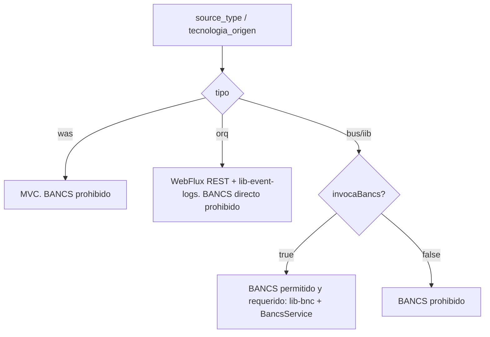

# doublecheck - doble pasada: checklist + autofixes + reporte final

Equivale al comando `capamedia checklist` (v0.23.0) pero ejecutado por el
engine AI elegido desde `capamedia ai doublecheck`. En Claude Code tambien
puede existir como slash command legacy `/doublecheck`.

Se usa **despues de `capamedia ai migrate`** para cerrar todo lo autofixeable
de una sola vez y dejar claro lo que queda como handoff al owner del servicio.

Diferencia con `capamedia check`:
- `capamedia check` - **solo reporta**, no modifica archivos.
- `capamedia ai doublecheck` - reporta + **aplica autofixes** + re-reporta.

## Cuando usarlo

- Despues de que `capamedia ai migrate` termino y el build esta verde.
- Antes de abrir el PR al banco.
- Cuando querés ver **qué queda realmente como trabajo manual** (sin el
  ruido de lo que el CLI puede arreglar solo).

## Input

- Ninguno si estas parado en el workspace root (autodetecta
  `./destino/<svc>` y `./legacy/<svc>`).
- Opcionales: `<project_path>` y `<legacy_path>` explicitos.

## Paso 1 — Pre-flight

Verificar que el workspace este valido:
- Existe `destino/<namespace>-msa-sp-<svc>/` con `build.gradle` + `src/`.
- Existe `legacy/` con el codigo legacy del servicio (opcional pero
  recomendado para cross-checks del Block 0).
- Existe `.capamedia/config.yaml` para leer el service_name.

Si falta `destino/` → abortar con mensaje claro.

## Paso 1.5 - Matriz BANCS obligatoria

Antes de aplicar autofixes, clasificar el proyecto con esta matriz. Esta regla
manda sobre templates, ejemplos previos y sugerencias del modelo:


```mermaid
flowchart TD
  A["source_type / tecnologia_origen"] --> B{tipo}
  B -->|was| C["MVC. BANCS prohibido"]
  B -->|orq| D["WebFlux REST + lib-event-logs. BANCS directo prohibido"]
  B -->|bus/iib| E{invocaBancs?}
  E -->|true| F["BANCS permitido y requerido: lib-bnc + BancsService"]
  E -->|false| G["BANCS prohibido"]
```

Si el proyecto es WAS, ORQ o BUS/IIB sin `invocaBancs=true`, el doublecheck
no debe agregar ni mantener `lib-bnc-api-client`, `BancsService`,
`BancsClientHelper`, `bancs.webclients`, `CCC_BANCS_*` ni
`dependsOn: lib-bnc-api-client`. Si aparecen, corregirlos o devolver
`status=blocked`; nunca declararlo PR_READY.

Si el proyecto es WAS, el doublecheck tampoco debe cambiar endpoints REST/SOAP
a `/IntegrationBus/soap/...`. WAS SOAP debe conservar el path WAS del
legacy/MCP, normalmente `/<ServiceName>/soap/*` y
`/<ServiceName>/soap/<ServiceName>Request`. `/IntegrationBus/soap/...` solo
aplica a BUS/IIB cuando el legacy lo prueba.

En ORQ, `REST + WebFlux` es solo el arquetipo Spring; el contrato externo viene
de WSDL/XSD y sigue siendo SOAP XML. `application/json`, DTOs JSON externos o
happy-path JSON son error salvo evidencia legacy explicita.

> **Falso positivo conocido del autofix Regla 8 (corregido v0.28.6):** una
> referencia a `UMP*` en el ESQL NO implica BANCS. Las UMP no-BANCS
> (`UMPSeguridad*`, `UMPAutorizadores*`, `UMPGenerico*`, wrappers de Cyxtera/ODM)
> NO requieren `lib-bnc-api-client`. La clasificacion la decide
> `.capamedia/fabrics.json` (`invoca_bancs`), no el conteo de UMPs. Si un
> servicio BUS-sin-BANCS termina con la lib, el Check 8.9 la marca HIGH (el
> PR-gate del banco la rechaza): removerla junto con las 3
> `spring.autoconfigure.exclude` BANCS y confirmar `invoca_bancs: false`.

## Paso 1.6 - Deployment metadata y Helm limpios

- `metadata.name` en `catalog-info.yaml` debe ser literalmente
  `tpl-middleware`.
- `metadata.namespace` en `catalog-info.yaml` debe salir del prefijo del
  componente migrado (`spring.application.name` o nombre del repo/carpeta):
  `csg-msa-sp-*` -> `csg-middleware`, `tnd-msa-sp-*` -> `tnd-middleware`, etc.
- `KUBERNETES_NAMESPACE` en `azure-pipelines.yml` debe coincidir con
  `metadata.namespace`.
- `helm/dev.yml`, `helm/test.yml` y `helm/prod.yml` no pueden contener
  placeholders `<...>` ni marcadores `TODO/TBD/PENDIENTE/VALIDAR/REVISAR`
  en lineas activas. Los comentarios inline en lineas `name:`/`value:` de env
  vars tambien son error.
- Autoscaling via **KEDA** (HPA derogado 2026-07): los 3 Helm deben tener
  `keda:` (`enabled: true`, `minReplicaCount`, `maxReplicaCount`, `triggers`)
  + `servicemonitor:` (`enabled: true`, `path: '/actuator/prometheus'`) y
  NINGUN bloque `hpa:`. El `namespace` del trigger y el `job=service-<app>` del
  `query` se resuelven del componente migrado (no dejar placeholders). Checks
  7.4/7.5d/7.5g. El autofix quita el `hpa:` pero NO inyecta `keda:` — si falta,
  generarlo desde la plantilla de migracion.
- `JAVA_OPTIONS` en los 3 Helm debe ser exactamente
  `-XX:MaxRAMPercentage=60.0 -XX:+UseStringDeduplication -XX:+UseG1GC`
  (ajuste 2026-07: sin `InitialRAMPercentage`, MaxRAM 60). Check 7.5f.
- `build.gradle` debe declarar las 3 deps de metricas Prometheus para KEDA
  (`micrometer-registry-prometheus`, `simpleclient_hotspot:0.16.0`,
  `simpleclient_common:0.16.0`). Check 8.11 (autofix `fix_add_prometheus_deps`).
- `build.gradle` debe declarar el plugin de peer review del banco en la version
  vigente: `id 'com.pichincha.frm-plugin-peer-review-gradle' version '1.1.2'`.
  Los scaffolds viejos de Fabrics traen `1.1.0`. Check 8.12 (autofix
  `fix_peer_review_plugin_version`, que solo actualiza una declaracion ya
  existente — ver Paso 2.5).
- `application*.yml` no puede definir `CCC_*: valor` ni usar defaults inline
  en placeholders `CCC_*`. Si referencia `${CCC_*}`, el valor concreto debe
  vivir en los 3 Helm (`dev/test/prod`).
- Si el proyecto WebFlux construye `WebClient.builder(` manualmente (ORQ/BUS
  con downstreams WS), debe seguir el patron oficial: records
  `HttpClientProperty`/`WebClientProperty` (prefix `webclient`), helper con
  `ConnectionProvider` + `.responseTimeout(...)` (NUNCA `ReadTimeoutHandler`),
  bean `WebClient.Builder` `<svc>WebClientBuilder` + bean `<svc>WebClient` por
  downstream, y bloque `webclient.<svc>` en application.yml con los 5 `${CCC_*}`
  (url/timeout/read-timeout/max-connections/pending-acquire-max-count).
  Check 7.9 (sin autofix — cirugia de codigo guiada por LT-3b / prompt REST
  §4.17). Migrar tambien `services.<svc>.base-url` legacy al prefijo
  `webclient.` y eliminar los timeouts globales compartidos.

## Paso 1.7 - error.recurso / error.componente sin nombre legacy

El response del servicio migrado debe llevar el **nombre del componente
MIGRADO** (`spring.application.name` = `<namespace>-msa-sp-<svc>`) en
`error.recurso` y `error.componente`. NUNCA el `metadata.name` fijo
`tpl-middleware` ni el nombre legacy IIB/WAS/ORQ corto. Aplica a WAS, BUS y ORQ.

```bash
# Senal de bug (QA del banco lo reporta como HIGH bloqueante):
grep -rnE 'setRecurso\(\s*"(WS|ORQ|UMP)[A-Za-z]*[0-9]+' src/main/java/
grep -rnE 'setComponente\(\s*"(WS|ORQ|UMP)[A-Za-z]*[0-9]+' src/main/java/
```

Valores aceptados para `componente`:
1. `<namespace>-msa-sp-<svc>` (servicio migrado / respuesta exitosa)
2. `ApiClient` (error propagado desde libreria)
3. `TX<NNNNNN>` (error de negocio desde Core Adapter, 6 digitos)

Si el doublecheck detecta el patron legacy, lo flaggea como HIGH y propone el
reemplazo por la constante `WS_COMPONENTE` alineada al `spring.application.name`.
Si el autofix encuentra `setRecurso("WSClientesNNNN/Op")`
o `setComponente("WSClientesNNNN")` con literal trazable al componente
migrado, lo aplica automaticamente. Validado por checklist Block 15.2 y 15.3.

**Referencia**: ticket QA BTHCCC-6826, mayo 2026.

## Paso 1.8 - Observabilidad ORQ: niveles de log externalizados + @BpLogger

**Solo orquestadores** (proyectos `*orq*`). Referencia: orqproductos0061,
commit `5e92bfa` (fix: Add logs variables). Checks 17.3 / 17.5 / 17.6 / 17.7
(sin autofix — el doublecheck aplica la cirugia a mano).

Los niveles de log de las libs del banco se **externalizan via ConfigMap**
(subir/bajar verbosidad en runtime sin rebuild). `application.yml` debe quedar
EXACTAMENTE asi bajo `logging.level` (el literal `kafka: OFF` viejo es FAIL):

```yaml
logging:
  level:
    org:
      apache:
        kafka: ${CCC_LOG_LEVEL_KAFKA}          # MANDATORY - suprime logs internos de Kafka (PDF lib-event-logs)
    com:
      pichincha:
        common: ${CCC_LOG_LEVEL_EVENT_LOGS}
        common.trace.logger: ${CCC_LOG_LEVEL_TRACE_LOGGER}
```

Y los 3 Helm (`helm/dev.yml`, `helm/test.yml`, `helm/prod.yml`) declaran las
3 env vars con el MISMO valor en los 3 ambientes:

```yaml
      # NIVELES DE LOG por libreria (externalizados via ConfigMap)
      - name: "CCC_LOG_LEVEL_KAFKA"
        value: "OFF"
      - name: "CCC_LOG_LEVEL_EVENT_LOGS"
        value: "OFF"
      - name: "CCC_LOG_LEVEL_TRACE_LOGGER"
        value: "INFO"
```

- `src/test/resources/application-test.yml` define los 3 `CCC_LOG_LEVEL_*` en
  la raiz (ej. `CCC_LOG_LEVEL_KAFKA: "OFF"`) para que los tests resuelvan los
  placeholders. Esto NO viola la regla "application.yml no define CCC_*" — esa
  regla aplica a `src/main/resources`, no a los recursos de test.
- **`@BpLogger` en los adapters downstream**: cada metodo de adapter outbound
  que lleva `@EventAudit` lleva TAMBIEN `@BpLogger`
  (`com.pichincha.common.trace.logger.annotation.BpLogger`), encima de
  `@EventAudit`. Check 17.7 (HIGH si falta).
- NO aplicar nada de esto a WAS/BUS: `lib-event-logs` y sus niveles son
  ORQ-only (el trace-logger de los Checks 7.7/7.8 si es universal).

## Paso 1.9 - Configurables del CSV operativo (IIB con `GestionarRecursoConfigurable`)

Solo si el servicio usa `GestionarRecursoConfigurable` / `Environment.cache.<Nombre>`.
El CSV vive en el repo local: `PromptCapaMedia/ConfigurablesBusOmni*.csv`.

**El archivo es ISO-8859-1 con delimitador `;`**, no UTF-8 ni coma. Un `grep` en
locale UTF-8 lo trata como binario y **sale con codigo 1 y sin salida, que es
identico a "no encontrado"**; `sort` muere con `Illegal byte sequence`. Asi se
reporto como ausente un configurable que tenia 12 filas (WSSeguridad0069,
2026-09-03), perdiendo la `url` y el `ns` del proveedor externo.

Forma correcta de consultarlo:

```bash
CSV="$(ls ~/BP/PromptCapaMedia/ConfigurablesBusOmni*.csv | head -1)"
iconv -f ISO-8859-1 -t UTF-8 "$CSV" | grep -i "UMPSeguridad0087Config"
echo "exit=$?"          # 0 = existe ; 1 = NO existe. Sin `|| echo`.
# columnas reales: Configurable;Variable;Valor   (los valores traen """X""" de Excel)
```

Reglas duras:

- **NUNCA** encadenar `|| echo "NO ENCONTRADO"` a la busqueda: convierte un
  fallo de la herramienta en un falso negativo silencioso. Mirar el exit code.
- **NUNCA** concluir ausencia desde un `head -N` de la lista: hay 533
  configurables distintos en 7868 filas.
- Solo con exit code `1` (leido OK y ausente) se documenta como pendiente del
  SRE. Si el CSV no se pudo leer, **no hay respuesta**: no inventar ni asumir.
- Valor encontrado -> va a `application.yml`. `url`/host/credenciales como
  `${CCC_*}` + Helm; flags y constantes como literal.

## Paso 1.10 - Sondas de management fuera del `lib-trace-logger`

Aplica a **TODO servicio migrado**. Fuente: `BPTPSRE-SpringBoot4-probes-actuator-logs`
§4, verificado con build verde en WSPagos0017 (MVC), WSProductos0178, ORQPagos0011,
ORQPagos0008 y ORQProductos1001 (WebFlux).

**Por que no alcanza con `logging.level`.** Los extractores del `lib-trace-logger`
no emiten lineas de log: son un `Filter`/`WebFilter` que vuelcan URI, metodo,
headers y body en `RequestInformationContextHolder`, que es un `@Component`
**singleton, no request-scoped**. Cada sonda de liveness/readiness/prometheus
**pisa el contexto compartido**, asi que un trace de negocio `@BpTraceable` puede
reportar `requestUri=/actuator/health/readiness` en vez del suyo. Es el hallazgo
del TO del 2026-08-25 (`"type":"TRANSACTIONAL"` con URI de actuator). Un filtro
adicional no sirve: hay que **reemplazar el bean** con un `BeanPostProcessor`.

**MUST en TODO servicio migrado**, sin excepciones:
`src/main/java/<base>/infrastructure/config/TraceLoggerManagementPathConfig.java`
(Regla 1: solo 3 capas; nombre `*Config` por code-style). **No depende de si el
servicio invoca BANCS, ni del origen (WAS/BUS/ORQ), ni de la cantidad de
operaciones**: si el proyecto tiene `lib-trace-logger`, tiene el problema.

La unica pregunta es que variante. Se decide **por el starter que declara
`build.gradle`**, nada mas:

| `build.gradle` declara | Variante | Extractor que envuelve |
|---|---|---|
| `spring-boot-starter-webflux` | reactiva | `ReactiveRequestInformationExtractor` |
| `spring-boot-starter-web` o `-web-services` | servlet | `ServletRequestInformationExtractor` |

```bash
grep -o "spring-boot-starter-web[a-z-]*" build.gradle | sort -u   # decide la variante
```

Para que quede sin ambiguedad, los casos de la matriz MCP que caen en **WebFlux**
(variante reactiva) son **tres**: ORQ, BUS/IIB con `invocaBancs=true`, y **BUS/IIB
sin BANCS con 1 operacion** (la matriz manda 1 op -> REST + WebFlux). Los que caen
en **servlet** son WAS y todo SOAP. Un BUS WebFlux sin BANCS **si lleva la clase**:
omitirla ahi fue un error real (WSSeguridad0069, 2026-09-03).

Poner la variante equivocada no compila contra el stack del proyecto. Compila
igual con `lib-trace-logger:1.4.0` y con `lib-trace-logger-sb4:1.2.0`: los FQCN de
los extractores no cambiaron.

### Variante WebFlux (ORQ, BUS + invocaBancs)

```java
package com.pichincha.sp.infrastructure.config;

import com.pichincha.common.trace.logger.extractor.request.information.reactive.ReactiveRequestInformationExtractor;
import org.springframework.beans.factory.config.BeanPostProcessor;
import org.springframework.context.EnvironmentAware;
import org.springframework.core.env.Environment;
import org.springframework.lang.NonNull;
import org.springframework.stereotype.Component;
import org.springframework.web.server.ServerWebExchange;
import org.springframework.web.server.WebFilter;
import org.springframework.web.server.WebFilterChain;
import reactor.core.publisher.Mono;

@Component
public class TraceLoggerManagementPathConfig implements BeanPostProcessor, EnvironmentAware {

  private static final String BASE_PATH_PROPERTY = "management.endpoints.web.base-path";
  private static final String DEFAULT_BASE_PATH = "/actuator";

  private String managementBasePath = DEFAULT_BASE_PATH;

  @Override
  public void setEnvironment(Environment environment) {
    String basePath = environment.getProperty(BASE_PATH_PROPERTY, DEFAULT_BASE_PATH);
    this.managementBasePath = basePath.isBlank() ? DEFAULT_BASE_PATH : basePath;
  }

  @Override
  public Object postProcessAfterInitialization(Object bean, String beanName) {
    if (bean instanceof ReactiveRequestInformationExtractor delegate) {
      return new ManagementPathAwareExtractor(delegate, managementBasePath);
    }
    return bean;
  }

  // El extractor de lib-trace-logger vuelca cada request en un RequestInformationContextHolder
  // singleton: las sondas de liveness/readiness/prometheus pisan el contexto del request de
  // negocio y ademas bufferean su body. Se las deja pasar sin capturar.
  private record ManagementPathAwareExtractor(WebFilter delegate, String managementBasePath)
      implements WebFilter {

    @NonNull
    @Override
    public Mono<Void> filter(@NonNull ServerWebExchange exchange, @NonNull WebFilterChain chain) {
      if (isManagementPath(exchange)) {
        return chain.filter(exchange);
      }
      return delegate.filter(exchange, chain);
    }

    private boolean isManagementPath(ServerWebExchange exchange) {
      return exchange
          .getRequest()
          .getPath()
          .pathWithinApplication()
          .value()
          .startsWith(managementBasePath);
    }
  }
}
```

### Variante Spring MVC / servlet (SOAP, WAS)

```java
package com.pichincha.sp.infrastructure.config;

import com.pichincha.common.trace.logger.extractor.request.information.servlet.ServletRequestInformationExtractor;
import jakarta.servlet.Filter;
import jakarta.servlet.FilterChain;
import jakarta.servlet.ServletException;
import jakarta.servlet.ServletRequest;
import jakarta.servlet.ServletResponse;
import jakarta.servlet.http.HttpServletRequest;
import java.io.IOException;
import org.springframework.beans.factory.config.BeanPostProcessor;
import org.springframework.context.EnvironmentAware;
import org.springframework.core.env.Environment;
import org.springframework.stereotype.Component;

@Component
public class TraceLoggerManagementPathConfig implements BeanPostProcessor, EnvironmentAware {

  private static final String BASE_PATH_PROPERTY = "management.endpoints.web.base-path";
  private static final String DEFAULT_BASE_PATH = "/actuator";

  private String managementBasePath = DEFAULT_BASE_PATH;

  @Override
  public void setEnvironment(Environment environment) {
    String basePath = environment.getProperty(BASE_PATH_PROPERTY, DEFAULT_BASE_PATH);
    this.managementBasePath = basePath.isBlank() ? DEFAULT_BASE_PATH : basePath;
  }

  @Override
  public Object postProcessAfterInitialization(Object bean, String beanName) {
    if (bean instanceof ServletRequestInformationExtractor delegate) {
      return new ManagementPathAwareExtractor(delegate, managementBasePath);
    }
    return bean;
  }

  // El extractor de lib-trace-logger vuelca cada request en un RequestInformationContextHolder
  // singleton: las sondas de liveness/readiness/prometheus pisan el contexto del request de
  // negocio y ademas cachean su body en memoria. Se las deja pasar sin capturar.
  private record ManagementPathAwareExtractor(Filter delegate, String managementBasePath)
      implements Filter {

    @Override
    public void doFilter(ServletRequest request, ServletResponse response, FilterChain chain)
        throws IOException, ServletException {
      if (request instanceof HttpServletRequest httpRequest && isManagementPath(httpRequest)) {
        chain.doFilter(request, response);
        return;
      }
      delegate.doFilter(request, response, chain);
    }

    private boolean isManagementPath(HttpServletRequest request) {
      return pathWithinApplication(request).startsWith(managementBasePath);
    }

    private String pathWithinApplication(HttpServletRequest request) {
      String uri = request.getRequestURI();
      String contextPath = request.getContextPath();
      if (contextPath == null || contextPath.isEmpty() || !uri.startsWith(contextPath)) {
        return uri;
      }
      return uri.substring(contextPath.length());
    }
  }
}
```

### Decisiones que no hay que cambiar

- **`BeanPostProcessor` que envuelve, no un filtro nuevo**: un filtro adicional no
  puede impedir que el extractor de la lib se ejecute.
- **Seleccion por `instanceof`, no por `beanName`**: el nombre del bean depende del
  component-scan de la libreria; la clase es contrato estable.
- **Base-path desde `Environment`** (`management.endpoints.web.base-path`, que
  viene de `${CCC_ACTUATOR_BASE_PATH}`), default `/actuator`. **Si llega en
  blanco cae a `/actuator`**: `startsWith("")` seria `true` para todo y apagaria
  la captura del servicio entero.
- `pathWithinApplication()` (WebFlux) / restar `getContextPath()` (servlet) para
  aguantar un `spring.webflux.base-path` o `server.servlet.context-path`.

**Efecto colateral conocido**: al envolver, el bean deja de resolverse por su tipo
concreto (`getBeanNamesForType(...Extractor.class).length == 0`). Verificado que
nada lo inyecta por tipo, solo se registra como `Filter`/`WebFilter`. Re-chequear
si sube `lib-trace-logger`.

## Paso 2 — Ejecutar `capamedia checklist`

```bash
# Desde el workspace root
capamedia checklist
```

Eso dispara internamente:
1. **Fase A** — correr los bloques activos del checklist (ver `ALL_BLOCKS` en `checklist_rules.py`: 17 bloques con IDs 0, 1, 2, 3, 5, 7, 8, 13-22) + autofix loop
   (hasta 3 rondas o convergencia). Los fixes cubren:
   - Regla 4: `@BpLogger` faltante en metodos publicos de `@Service`
   - Regla 6: `StringUtils.*` → Java nativo, extraer records inner del Service
   - Regla 7: `${VAR:default}` → `${VAR}` limpio (preserva `optimus.web.*`)
   - Regla 8: fijar `lib-bnc-api-client` a la version del OLA del servicio
     (`1.1.0` OLA 1, `2.0.0` OLA 2) solo si la matriz permite BANCS (BUS/IIB
     + invocaBancs=true)
   - Regla Gradle REST/BANCS: `lib-bnc-api-client` debe quedar en la version
     del OLA del servicio (`1.1.0` OLA 1, `2.0.0` OLA 2) y Resilience4j debe
     usar el starter compatible con Spring Boot 3 (`resilience4j-spring-boot3`)
   - Regla 9: esqueleto inicial de `catalog-info.yaml`
   - Regla 9h.1: `resources` al baseline + eliminar el bloque `hpa:` derogado
     (el `keda:`/`servicemonitor:` lo genera la plantilla de migracion)
   - Regla 9h.2: `JAVA_OPTIONS` al baseline
     (`-XX:MaxRAMPercentage=60.0 -XX:+UseStringDeduplication -XX:+UseG1GC`)
   - Regla 9h.3 / 8.11: inyectar las 3 deps de metricas Prometheus para KEDA
   - Block 19: inyectar valores de `.capamedia/inputs/*.properties` a
     `application.yml` (si el owner ya entrego los archivos)

2. **Fase B** — re-correr el checklist para ver el estado final post-fix.

## Paso 2.5 - Peer review del banco

El doublecheck tambien debe revisar el gate del plugin
`frm-plugin-peer-review-gradle`, porque Azure ejecuta `gradle build -x test`
pero el task `architectureReview` sigue corriendo.

**Version del plugin (Check 8.12):** el bloque `plugins {}` de `build.gradle`
debe declarar la version vigente:

```groovy
plugins {
    id 'com.pichincha.frm-plugin-peer-review-gradle' version '1.1.2'
}
```

Una version menor (los scaffolds viejos de Fabrics traen `1.1.0`) es
**FAIL HIGH**. El autofix `fix_peer_review_plugin_version` actualiza una
declaracion existente, pero **NO inyecta el plugin si falta del todo**: el
plugin se resuelve desde el repo interno del banco declarado en
`settings.gradle`, y agregar un `id` que Gradle no pueda resolver rompe el build
entero. Si el check reporta "falta el plugin", agregarlo a mano y verificar que
`settings.gradle` tenga el repositorio del banco.

```bash
cd destino/<namespace>-msa-sp-<svc>
./gradlew architectureReview
```

Si el comando no existe, leer la salida de `gradle build -x test` o el reporte
en `build/reports`. No declarar OK si aparece cualquiera de estos sintomas:

- score global < 7
- `BLOQUEAR PR: SI`
- `Paquetes: 3 / 4` u observaciones generales por naming/layout
- observaciones de tests: falta `@SpringBootTest`, falta H2,
  falta `application-test.yml`, falta status 200/404/500

Fix esperado:
- mover ports a `application/input/port` y `application/output/port`
- convertir ports a interfaces si queda algun `abstract class`
- agregar integration smoke test con `@SpringBootTest` y la herramienta del
  stack (`MockMvc`, `WebTestClient` o `MockWebServiceClient`)
- mantener unit tests con Mockito para logica de dominio/aplicacion
- asegurar que el `.gitignore` del proyecto migrado ignore artefactos locales
  que no van a Azure DevOps: `.capamedia/`, `.codex/`, `.claude/`,
  `.cursor/`, `.windsurf/`, `.opencode/`, `.github/prompts/`, `.vscode/`,
  `.idea/`, `.mcp.json`, `FABRICS_PROMPT_*.md`, `QA_STATUS.md`, `TRAMAS.txt`.

## Paso 3 — Interpretar el resultado

El reporte final muestra 3 tipos de items:

### ✅ PASS
Reglas que pasaron o se fixearon solas. No hay nada que hacer.

### 🟡 FAIL MEDIUM / LOW residuales
Cosas que NO pudo arreglar el autofix pero que **NO bloquean el PR**.
Ejemplos tipicos:

- `properties-report.yaml` lista archivos PENDING_FROM_BANK (esperar al owner)
- Algunos configurables sin valor real (requieren input de SRE)
- `catalog-info.yaml` tiene owner email placeholder (completar manual)

### 🔴 FAIL HIGH residuales
**Esto sí requiere intervencion manual.** Posibles causas:

- Regla 6: metodos privados en `@Service` que el autofix no supo extraer
  (requiere refactor semantico manual)
- Block 0.2c: framework mal-clasificado (mover el codigo a REST/SOAP segun
  matriz MCP)
- Block 20: ORQ referenciando legacy del target (cambiar URL al servicio
  migrado)
- Block 3: clases con nombres genericos (renombrar con prefijo de dominio)

## Paso 4 — Handoff explicito

Cosas que NO se pueden arreglar automaticamente y deben documentarse como
**handoff** (no como bug):

| Item | Por que no se puede fixear solo | Accion |
|---|---|---|
| `sonarcloud.io/project-key` | SonarCloud genera el UUID al primer analisis | Esperar primer pipeline + copiar el key |
| URL de Confluence | Depende del espacio del equipo | Owner completa manual |
| `<ump>.properties` PENDING | Viene del owner del servicio | Pedirlo + pegar en `.capamedia/inputs/` |
| JNDI desconocido o ambiguo (WAS+BD) | Fuera del catalogo BPTPSRE-Secretos o con secrets conflictivos | Consultar con SRE |

Estos quedan marcados como FAIL pero **son esperados** — no cambian al
developer, son handoff a otros roles.

## Paso 5 — Responder conversacionalmente

Al final del doublecheck, responder con un resumen:

```markdown
## Doble check ejecutado: <servicio>

**Pasos corridos:**
- Checklist (17 bloques activos de `ALL_BLOCKS`): <X/Y PASS>
- Autofixes aplicados: <N> (reglas 4, 6, 7, 8, 9 + Block 19 inject)
- Re-check post-fix: <X'/Y PASS>

### Estado final
- PR_READY / READY_WITH_FOLLOW_UP / BLOCKED_BY_HIGH

### Fixes aplicados automaticamente
1. `lib-bnc-api-client` fijado a la version del OLA (1.1.0 OLA 1 / 2.0.0 OLA 2)
2. `@BpLogger` agregado a 3 metodos de CustomerServiceImpl
3. 4 env vars `${CCC_*}` reemplazados con valores de umpclientes0025.properties
...

### Residuales HIGH (requieren revision manual)
_(si hay)_

### Handoff al owner (NO son bugs)
- `sonarcloud.io/project-key`: completar despues del primer pipeline
- `umpXXXX.properties`: pedir al owner del servicio (keys: ...)

**Proximo paso:** `capamedia review` para correr el validador oficial del banco,
o abrir el PR si no hay residuales HIGH.
```

## Reglas importantes

1. **No saltarse fases.** Checklist → autofix → re-check → reporte. Siempre
   en ese orden.
2. **Severidad conservadora.** Si un fix autofix rompe la compilacion, el
   checklist siguiente lo detecta y marca HIGH.
3. **Nunca inventar secretos ni config keys.** Lo desconocido se marca como
   handoff, no se completa con placeholder al voleo.
4. **No correr `capamedia ai migrate`, `batch migrate` ni `/migrate` en el medio.**
   El doublecheck asume que el codigo ya esta migrado y compila; solo pule lo
   determinista.
5. **No aceptar peer review rojo.** Si `architectureReview` reporta
   `BLOQUEAR PR: SI`, score bajo, u observaciones de arquitectura/tests,
   corregirlo o marcar `status=blocked`; nunca reportar PR_READY.
6. **No ensuciar Azure DevOps.** `.capamedia/` y los harnesses/prompts locales
   de IA deben quedar en `.gitignore`.
7. **Informativo, no destructivo.** Todo cambio del autofix queda en
   `.capamedia/autofix/<ts>.log` para trazabilidad.
8. **Config is not an output port.** Si ves `*ConfigOutputPort` o un adapter
   que solo lee env/YAML/properties, reemplazar por `@ConfigurationProperties`
   o bean de config; los output ports son para dependencias externas.
9. **Spring Boot baseline (mínimo, no tope).** `build.gradle` debe quedar con
   `id 'org.springframework.boot' version '3.5.15'` **o superior**. **NUNCA
   bajar la versión que generó el MCP** (un `4.1.1` se conserva). Solo si
   aparece una versión *menor* al mínimo, actualizar el literal del plugin sin
   reemplazar el scaffold del MCP.
10. **Pipeline/catalog namespace.** `KUBERNETES_NAMESPACE` en
    `azure-pipelines.yml` debe coincidir con `metadata.namespace` de
    `catalog-info.yaml`.
11. **Gradle seguridad.** No debe quedar `spring-boot-starter-undertow`,
    `io.undertow:*` ni `undertowVersion`; usar default embebido
    Tomcat para MVC/Spring WS o Netty para WebFlux. **No agregar pins de
    `io.netty:*`** (ni `dependency` ni `force`): manda el BOM de Spring Boot.
    Si el proyecto ya trae el pin tolerado `io.netty:*:4.1.136.Final` (legado
    Spring Boot 3.5.x WebFlux), no hace falta tocarlo.
12. **WAS Hikari.** Si WAS usa JPA/Hikari, validar query por motor:
    SQL Server=`SELECT 1`; Oracle=`SELECT 1 from dual`.
10. **Helm env limpio.** En `helm/dev.yml`, `helm/test.yml` y `helm/prod.yml`,
    las variables de entorno no pueden tener `value: "<CCC_...>"`,
    `TODO/TBD/PENDIENTE/VALIDAR/REVISAR` ni comentarios inline en líneas
    `name:`/`value:`. Si falta el valor real, reportarlo como handoff fuera del
    Helm; no declarar PR_READY.
