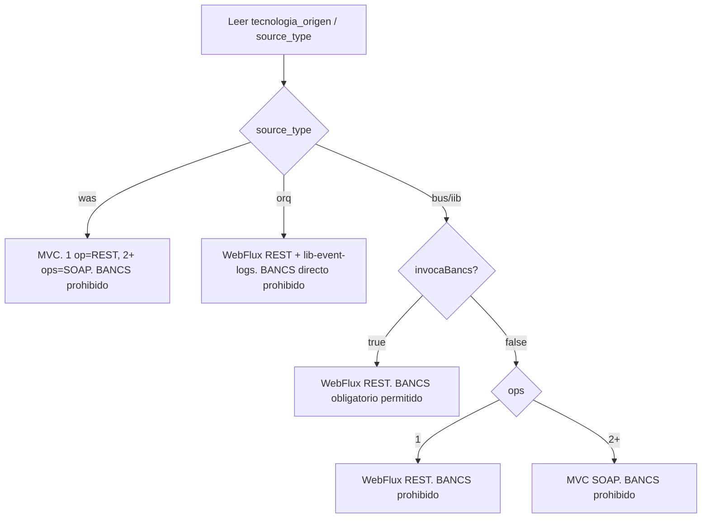

# migrate

Migra toda la lógica del servicio legacy al arquetipo destino generado por Fabrics.

## Prerequisitos

1. Haber corrido `capamedia clone <servicio>` - deja `legacy/`, `umps/`, `tx/`, `gold-ref/`, `COMPLEXITY_*.md`.
2. Haber corrido `capamedia fabrics generate` - deja `destino/<namespace>-msa-sp-<servicio>/` con el scaffold base.
3. Ejecutar desde la raiz del workspace; no desde `destino/`.

## Paso 1 — Detectar modo

Leer `bank-mcp-matrix.md`, `COMPLEXITY_<servicio>.md` y
`migration-context.json` en `destino/`. La matriz BPTPSRE manda sobre cualquier
heuristica local:



- Si `projectType=rest` + `webFramework=mvc` + `sourceKind=was` -> cargar
  `migrate-rest-full.md` en modo WAS REST/MVC.
- Si `projectType=rest` + `webFramework=webflux` -> cargar
  `migrate-rest-full.md` en modo BUS/ORQ REST/WebFlux.
- Si `projectType=soap` -> cargar `migrate-soap-full.md` en modo SOAP/MVC.
- Si `migration-context.json` contradice `bank-mcp-matrix.md` -> detenerse y
  pedir confirmacion; no cambiar el arquetipo por cuenta propia.

## Paso 2 — Lanzar agente migrador

Usar el sub-agente `migrador` (definido en `.claude/agents/migrador.md` del proyecto) con este contexto:

- `legacy/` — fuente original (ESQL, WSDL, XSDs, msgflows)
- `umps/` — UMPs asociados con sus ESQL (para extraer TX reales)
- `gold-ref/` — proyecto gold (0024 para REST, 0015 para SOAP) como referencia de patrones
- `destino/tnd-msa-sp-<servicio>/` — destino donde se implementa
- `COMPLEXITY_<servicio>.md` — análisis previo
- `bank-mcp-matrix.md` — fuente unica para decidir REST/WebFlux, REST/MVC o SOAP/MVC

El agente ejecuta los 7 bloques del prompt de migración:

1. **Block 1: Scaffolding** — verificar el scaffold del MCP, ajustar si falta algo
2. **Block 2: Domain layer** — records, exceptions, sin imports de framework
3. **Block 3: Application layer** — interface ports + services
4. **Block 4: Infrastructure layer** — controllers, DTOs, mappers, adapters BANCS, error resolvers, application.yml
5. **Block 5: Helm + Docker** — values-{dev,test,prod}.yaml con probes
6. **Block 6: Tests** — unit + integration con JUnit 5, Mockito, StepVerifier
7. **Block 7: Core Adapter beans** — `@BancsService` config por TX

## Paso 3 — Loop de autocorrección por GATE

Cada bloque tiene un GATE de verificación (grep por imports prohibidos, build gradle, tests pasando). Si falla:
1. Identificar qué falló
2. Analizar causa
3. Corregir
4. Re-verificar
5. Max 3 intentos antes de escalar al usuario

## Paso 4 — Loop de build

Después del Block 7, correr en loop:

```bash
cd destino/tnd-msa-sp-<servicio>/
./gradlew generateFromWsdl && ./gradlew clean build
```

Si falla:
- Parsear el error
- Aplicar fix
- Re-intentar (max 5 ciclos)

## Paso 4.5 - Gate peer review del banco

El build de Azure ejecuta `gradle build -x test`, pero `architectureReview`
sigue corriendo y analiza arquitectura + tests. Despues de compilar, ejecutar o
leer la salida de:

```bash
./gradlew architectureReview
```

Reglas:
- No cerrar con `build_status=green` si `architectureReview` queda con score < 7,
  `BLOQUEAR PR: SI`, u observaciones generales/test sin resolver.
- Objetivo operativo: score >= 9 y sin observaciones accionables.
- Si aparece `Paquetes: 3 / 4`, mover ports a
  `application/input/port` y `application/output/port`.
- Si aparecen observaciones de tests, agregar `application-test.yml`, H2 si hay
  DB, y al menos un test `@SpringBootTest` con MockMvc/WebTestClient/
  MockWebServiceClient y asserts 200/404/500 donde aplique.

## Paso 5 — Generar reporte

Escribir `destino/tnd-msa-sp-<servicio>/MIGRATION_REPORT.md` con:
- Bloques ejecutados y sus GATEs
- Archivos creados / modificados
- Workarounds aplicados (gaps del MCP, feedbacks del equipo)
- Cobertura de tests (del jacocoTestReport)
- GenAI section — qué modelo ejecutó cada bloque

## Paso 6 — Responder conversacionalmente

```markdown
## Migración completada: <servicio>

- **Modo:** REST + WebFlux / REST + Spring MVC / SOAP + Spring MVC
- **Archivos creados:** N
- **Build:** verde (./gradlew build)
- **Tests:** X/Y pasando, cobertura Z%

### Siguiente paso

Corré `/check` para validar contra la checklist BPTPSRE y cruzar con el legacy.
```

## Reglas importantes

**Regla de endpoint WAS:** en servicios `source_type=was`, no reescribir rutas REST/SOAP a `/IntegrationBus/soap/...`. WAS SOAP conserva el path del legacy/MCP, normalmente `/<ServiceName>/soap/*` y `/<ServiceName>/soap/<ServiceName>Request`; WAS REST/MVC conserva su endpoint WAS. `/IntegrationBus/soap/...` solo aplica a BUS/IIB cuando el legacy lo prueba.

1. **No sobrescribir `build.gradle` del MCP.** Sólo agregar dependencias faltantes; nunca reemplazar el archivo.
2. **Puertos son interfaces, nunca abstract classes.**
3. **Domain sin imports de Spring/JPA/WebFlux.**
4. **HTTP 200 para errores de negocio** (compatibilidad con IIB caller).
5. **Secrets vía `${CCC_*}` env vars.**
6. **Código en inglés**, documentación en inglés.
7. **DB no cambia REST/SOAP.** WAS REST/MVC con DB usa HikariCP+JPA+Oracle. Si un caso BUS/ORQ WebFlux trae DB propia, escalar o aislar el bloqueo con R2DBC/`Schedulers.boundedElastic()`; nunca meter HikariCP+JPA en el request path de WebFlux.
8. **Higiene de `.gitignore` antes de cerrar:** el `.gitignore` del proyecto migrado debe ignorar `.capamedia/`, `.codex/`, `.claude/`, `.cursor/`, `.windsurf/`, `.opencode/`, `.github/prompts/`, `.vscode/`, `.idea/`, `.mcp.json`, `FABRICS_PROMPT_*.md`, `QA_STATUS.md` y `TRAMAS.txt`. No ignorar `.sonarlint/connectedMode.json`.
9. **BANCS no se infiere por nombre ni por template.** Solo BUS/IIB con `invocaBancs=true` puede agregar `lib-bnc-api-client`, `BancsService`, `BancsClientHelper`, `bancs.webclients`, `CCC_BANCS_*` o `dependsOn: lib-bnc-api-client`. En WAS, ORQ y BUS sin BANCS, esos artefactos son error de migracion y deben removerse.
10. **Config is not an output port.** Env/YAML/properties van por `@ConfigurationProperties` o bean de config; nunca crear `*ConfigOutputPort` ni adapter de infraestructura solo para leer config.
11. **Spring Boot baseline:** antes de cerrar, `build.gradle` debe declarar `id 'org.springframework.boot' version '3.5.14'` o superior aprobado. Si Fabrics genera una versión menor, actualizar sólo ese literal sin reemplazar el `build.gradle` completo.
12. **Helm env limpio:** en `helm/dev.yml`, `helm/test.yml` y `helm/prod.yml`, las variables de entorno no pueden quedar como `value: "<CCC_...>"`, `TODO/TBD/PENDIENTE/VALIDAR`, ni con comentarios inline en líneas `name:`/`value:`. Si falta el valor real, reportarlo como handoff fuera del Helm.
13. **Pipeline/catalog namespace:** `KUBERNETES_NAMESPACE` en `azure-pipelines.yml` debe coincidir con `metadata.namespace` de `catalog-info.yaml`.
14. **Gradle seguridad:** no dejar `spring-boot-starter-undertow`, `io.undertow:*` ni `undertowVersion`. Usar servidor embebido default: Tomcat para MVC/Spring WS, Netty para WebFlux.
15. **WAS Hikari:** si WAS usa JPA/Hikari, `connection-test-query` depende del motor: SQL Server=`SELECT 1`, Oracle=`SELECT 1 from dual`.
