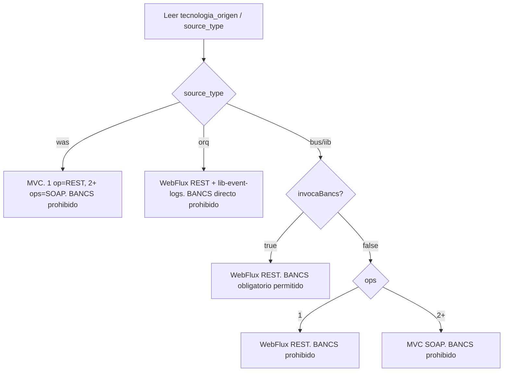

# migrate (router)

Este prompt **no implementa codigo**. Es un router que:

1. Detecta el modo segun `bank-mcp-matrix.md`.
2. Carga el prompt detallado correspondiente (`migrate-rest-full.md` o `migrate-soap-full.md`).
3. Lanza el sub-agente `migrador` con ese prompt.
4. Corre los loops de autocorreccion/build/peer-review.

**Toda regla tecnica vive en el prompt full elegido.** Este router no debe duplicar reglas de arquitectura, dependencias, BANCS, Helm, logging ni error handling. Si aparece una duplicacion, es deuda de documentacion y debe eliminarse.

## Prerequisitos

1. `capamedia clone <servicio>` — deja `legacy/`, `umps/`, `tx/`, `COMPLEXITY_*.md`.
2. `capamedia fabrics generate` — deja `destino/<namespace>-msa-sp-<servicio>/` con el scaffold base.
3. Ejecutar desde la raiz del workspace, no desde `destino/`.

`<namespace>` es el codigo de tribu (`tnd`, `csg`, `tia`, etc.) que sale de `.capamedia/config.yaml`, `spring.application.name` o el nombre del repo/carpeta que ya genero Fabrics. Nunca asumir `tnd-`; `catalog-info.yaml` `metadata.name` queda fijo en `tpl-middleware`.

## Paso 1 — Detectar modo (matriz MCP)

Leer `bank-mcp-matrix.md`, `COMPLEXITY_<servicio>.md` y `migration-context.json` en `destino/`. La matriz manda sobre cualquier heuristica local:



Ruteo:

- `projectType=rest` + `webFramework=mvc` + `sourceKind=was` -> cargar `migrate-rest-full.md` (modo WAS REST/MVC).
- `projectType=rest` + `webFramework=webflux` -> cargar `migrate-rest-full.md` (modo BUS/ORQ REST/WebFlux).
- `projectType=soap` -> cargar `migrate-soap-full.md` (modo SOAP/MVC).
- Si `migration-context.json` contradice `bank-mcp-matrix.md` -> detenerse y pedir confirmacion; no cambiar el arquetipo por cuenta propia.

## Paso 2 — Lanzar agente migrador

Usar el sub-agente `migrador` con este contexto minimo:

- `legacy/` — fuente original (ESQL, WSDL, XSDs, msgflows)
- `umps/` — UMPs asociados con sus ESQL (para extraer TX reales)
- `destino/<namespace>-msa-sp-<servicio>/` — destino donde se implementa
- `COMPLEXITY_<servicio>.md` — analisis previo
- `bank-mcp-matrix.md` — fuente unica de la decision REST/WebFlux, REST/MVC, SOAP/MVC
- `migrate-rest-full.md` **o** `migrate-soap-full.md` — el que corresponda segun Paso 1

El agente ejecuta los bloques definidos en ese prompt full (no se redefinen aqui).

## Paso 3 — Loop de autocorreccion por GATE

Cada bloque del prompt full tiene un GATE de verificacion. Si falla:

1. Identificar que fallo
2. Analizar causa
3. Corregir
4. Re-verificar
5. Max 3 intentos antes de escalar al usuario

## Paso 4 — Loop de build

Despues del ultimo bloque, correr en loop:

```bash
cd destino/<namespace>-msa-sp-<servicio>/
./gradlew generateFromWsdl && ./gradlew clean build
```

Si falla: parsear error, aplicar fix, re-intentar (max 5 ciclos).

## Paso 4.5 — Gate peer review del banco

Azure CI corre `gradle build -x test`, pero `architectureReview` analiza arquitectura + tests. Ejecutar (o leer la salida de):

```bash
./gradlew architectureReview
```

Reglas:

- No cerrar con `build_status=green` si `architectureReview` deja score < 7, `BLOQUEAR PR: SI`, u observaciones generales/test sin resolver.
- Objetivo operativo: score >= 9 y sin observaciones accionables.
- Si aparece `Paquetes: 3 / 4`, mover ports a `application/input/port` y `application/output/port`.
- Si aparecen observaciones de tests, agregar `application-test.yml`, H2 si hay DB, y al menos un test `@SpringBootTest` con MockMvc/WebTestClient/MockWebServiceClient y asserts 200/404/500 donde aplique.

## Paso 5 — Generar reporte

Escribir `destino/<namespace>-msa-sp-<servicio>/MIGRATION_REPORT.md` con:

- Bloques ejecutados y sus GATEs
- Archivos creados / modificados
- Workarounds aplicados (gaps del MCP, feedbacks del equipo)
- Cobertura de tests (del jacocoTestReport)
- GenAI section — que modelo ejecuto cada bloque

## Paso 6 — Responder conversacionalmente

```markdown
## Migracion completada: <servicio>

- **Modo:** REST + WebFlux / REST + Spring MVC / SOAP + Spring MVC
- **Prompt usado:** migrate-rest-full.md / migrate-soap-full.md
- **Archivos creados:** N
- **Build:** verde (./gradlew build)
- **Tests:** X/Y pasando, cobertura Z%

### Siguiente paso

Corre `capamedia ai doublecheck` para autofix y `capamedia check` para validar contra el checklist BPTPSRE.
```

## Reglas (solo las imprescindibles para el ruteo)

Las reglas tecnicas (arquitectura, BANCS, Helm, dependencias, naming, error handling, etc.) viven en el prompt full elegido. **No se duplican aca.**

Estas pocas reglas son las que decide este router:

1. **No reescribir `build.gradle`/`settings.gradle` del MCP.** Aplicar solo deltas; las reglas detalladas (versiones, starters permitidos/prohibidos) estan en el prompt full.
2. **No cambiar el arquetipo por cuenta propia.** Si la matriz dice X y `migration-context.json` dice Y, parar y pedir confirmacion.
3. **BANCS no se infiere por nombre, template ni "ejemplo similar".** Solo BUS/IIB con `invocaBancs=true` puede agregar `lib-bnc-api-client`, `BancsService`, `BancsClientHelper`, `bancs.webclients`, `CCC_BANCS_*` o `dependsOn: lib-bnc-api-client`. En WAS, ORQ y BUS sin BANCS, son error de migracion. (Detalle en el prompt full.)
4. **Endpoint WAS:** en `source_type=was`, no reescribir rutas a `/IntegrationBus/soap/...`; WAS conserva su path del legacy/MCP. (Detalle en el prompt full.)
5. **Config is not an output port.** Env/YAML/properties van por `@ConfigurationProperties` o bean de config; NUNCA crear `*ConfigOutputPort` ni adapter de infraestructura solo para leer config. (Regla operativa que afecta el ruteo de adapters; detalle en el prompt full.)
